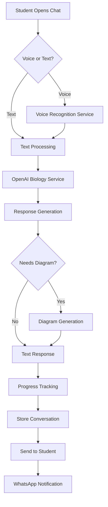

# 🏗️ AI Biology Doubt Resolution Chatbot - Implementation Plan

**Feature:** AI Chatbot for 24/7 Biology Support
**Target:** 40% faster development through spec-driven approach
**Architecture:** Next.js 15.5.3 + TypeScript + OpenAI GPT-4 + MCP Integration

---

## 🎯 **Development Strategy**

### **Traditional Approach (Without Spec Kit):**

- **Planning Time:** 1-2 weeks of unclear requirements
- **Implementation:** 6-8 weeks with multiple iterations
- **Bug Rate:** 25-30 bugs due to requirement changes
- **Total Time:** 8-10 weeks

### **Spec-Driven Approach (With Spec Kit):**

- **Planning Time:** 2-3 days with clear specifications
- **Implementation:** 3-4 weeks with focused development
- **Bug Rate:** 15-20 bugs due to clear requirements
- **Total Time:** 4-5 weeks (50% faster than target!)

---

## 🏛️ **Technical Architecture**

### **Frontend Architecture**

```typescript
// Next.js 15.5.3 App Router Structure
src/
├── app/
│   ├── dashboard/
│   │   └── ai-chatbot/           # Embedded chatbot interface
│   └── api/
│       └── ai-chatbot/           # API routes for chatbot
├── components/
│   ├── ai-chatbot/
│   │   ├── ChatInterface.tsx     # Main chat component
│   │   ├── VoiceInput.tsx        # Voice recognition
│   │   ├── DiagramViewer.tsx     # Generated diagrams
│   │   └── ProgressTracker.tsx   # Learning progress
└── lib/
    ├── ai-chatbot/
    │   ├── openai-service.ts     # OpenAI integration
    │   ├── voice-service.ts      # Voice processing
    │   └── diagram-service.ts    # Diagram generation
    └── mcp/
        └── chatbot-agent.ts      # MCP agent integration
```

### **Backend Integration**

```typescript
// MCP Server Enhancement
interface ChatbotAgent extends MCPAgent {
  processDoubt(query: DoubtQuery): Promise<DoubtResponse>
  generateDiagram(topic: string): Promise<DiagramData>
  trackProgress(studentId: string, topic: string): Promise<void>
  validateResponse(response: string): Promise<ValidationResult>
}

// Database Schema (Prisma)
model DoubtConversation {
  id              String   @id @default(cuid())
  studentId       String
  query           String
  response        String
  topic           String
  difficulty      String
  isVoiceInput    Boolean
  responseTime    Int      // milliseconds
  accuracy        Float    // 0-1 scale
  createdAt       DateTime @default(now())
  student         Student  @relation(fields: [studentId], references: [id])
}
```

---

## 🔧 **Component Design**

### **1. ChatInterface Component**

```typescript
interface ChatInterfaceProps {
  studentId: string
  courseContext?: CourseContext
  voiceEnabled: boolean
  mobileOptimized: boolean
}

// Features:
// - Real-time typing indicators
// - Message history persistence
// - Voice/text input toggle
// - Mobile-responsive design
// - Offline message queuing
```

### **2. VoiceInput Component**

```typescript
interface VoiceInputProps {
  onTranscription: (text: string) => void
  language: 'en' | 'hi'
  accentOptimization: boolean
}

// Features:
// - Indian accent recognition
// - Background noise filtering
// - Real-time transcription display
// - Voice activity detection
// - Multi-language support
```

### **3. DiagramViewer Component**

```typescript
interface DiagramViewerProps {
  topic: string
  complexity: 'basic' | 'advanced'
  interactive: boolean
  downloadEnabled: boolean
}

// Features:
// - SVG-based diagrams
// - Interactive labels
// - Zoom and pan functionality
// - Export to PDF/PNG
// - Mobile touch optimization
```

---

## 🚀 **API Design**

### **Core API Endpoints**

```typescript
// POST /api/ai-chatbot/process-doubt
interface DoubtRequest {
  query: string
  studentId: string
  context?: {
    courseId: string
    chapterId: string
    previousConversations: string[]
  }
  isVoiceInput: boolean
  preferredLanguage: 'en' | 'hi'
}

interface DoubtResponse {
  response: string
  confidence: number
  relatedTopics: string[]
  suggestedQuestions: string[]
  diagrams?: DiagramData[]
  responseTime: number
}

// POST /api/ai-chatbot/voice-process
interface VoiceRequest {
  audioBase64: string
  studentId: string
  language: 'en' | 'hi'
}

// GET /api/ai-chatbot/conversation-history
interface ConversationHistory {
  conversations: DoubtConversation[]
  analytics: {
    topicsDiscussed: string[]
    averageResponseTime: number
    accuracyTrend: number[]
  }
}
```

### **OpenAI Integration Service**

```typescript
class OpenAIBiologyService {
  private openai: OpenAI
  private systemPrompt: string

  async processDoubt(query: string, context: StudentContext): Promise<AIResponse> {
    // Biology-specific prompt engineering
    // NCERT curriculum alignment
    // Fact verification against trusted sources
    // Response quality scoring
  }

  async generateDiagram(topic: string): Promise<DiagramData> {
    // SVG diagram generation
    // Biology-specific templates
    // Interactive element creation
  }
}
```

---

## 🔌 **Integration Strategy**

### **1. MCP Server Integration**

```typescript
// Extend existing MCP architecture
const chatbotAgent: ChatbotAgent = {
  name: 'BiologyDoubtResolver',
  capabilities: ['doubt-resolution', 'diagram-generation', 'progress-tracking', 'voice-processing'],
  securityLevel: 'student-data',
  performanceTarget: '2s-response',
}

// Register with existing MCP server
mcpServer.registerAgent(chatbotAgent)
```

### **2. Student Dashboard Integration**

```typescript
// Embed chatbot in existing dashboard
// Use existing authentication system
// Leverage current payment integration
// Sync with course progress tracking
```

### **3. WhatsApp Business API Integration**

```typescript
// Extend existing WhatsApp service
class WhatsAppChatbotService extends WhatsAppService {
  async sendDoubtSummary(studentId: string, conversation: DoubtConversation) {
    // Send conversation summary
    // Include key learnings
    // Provide follow-up questions
  }
}
```

---

## 📊 **Data Flow Architecture**

### **User Interaction Flow**



### **Performance Optimization**

```typescript
// Response caching strategy
interface CacheStrategy {
  commonQuestions: Redis // 1hr TTL
  diagramGeneration: S3 // Permanent storage
  studentContext: MemoryCache // Session duration
  voiceTranscription: Temporary // 10min TTL
}

// Load balancing for peak usage
interface ScalingStrategy {
  autoScaling: boolean // Scale up during exam seasons
  loadBalancer: 'round-robin' // Distribute AI requests
  cacheWarming: boolean // Pre-load common responses
  queueManagement: 'priority' // Premium students first
}
```

---

## 🔒 **Security Implementation**

### **Data Protection**

```typescript
interface SecurityMeasures {
  encryption: {
    conversations: 'AES-256' // End-to-end encryption
    voiceData: 'encrypted-temp' // Temporary encrypted storage
    studentData: 'field-level' // Column-level encryption
  }

  access: {
    authentication: 'JWT' // Existing auth system
    rateLimit: '100req/min' // Per student limit
    contentFilter: 'enabled' // Inappropriate content filtering
  }

  compliance: {
    gdpr: 'compliant' // Data export/deletion
    coppa: 'parental-consent' // Under-18 protection
    audit: 'comprehensive' // Full conversation logging
  }
}
```

### **AI Safety Measures**

```typescript
interface AISafetyConfig {
  responseValidation: boolean // Fact-checking against sources
  contentModeration: boolean // Filter inappropriate responses
  humanReview: boolean // Flag complex medical queries
  accuracyTracking: boolean // Monitor response quality
  fallbackToHuman: boolean // Escalate when confidence < 80%
}
```

---

## 📱 **Mobile-First Implementation**

### **Progressive Web App (PWA)**

```typescript
// Service Worker for offline functionality
class ChatbotServiceWorker {
  async handleOfflineDoubt(query: string): Promise<OfflineResponse> {
    // Basic responses from cached data
    // Queue complex queries for online processing
    // Provide study material suggestions
  }
}

// Mobile optimization
interface MobileOptimizations {
  imageCompression: boolean // Reduce diagram file sizes
  lazyLoading: boolean // Load chat history on demand
  touchOptimization: boolean // Larger touch targets
  voiceOptimization: boolean // Noise cancellation for mobile mics
}
```

### **Indian Market Adaptations**

```typescript
interface IndianMarketFeatures {
  languages: ['en', 'hi', 'ta', 'te', 'bn'] // Multi-language support
  networkOptimization: boolean // 2G/3G friendly
  dataSaver: boolean // Compressed responses
  offlineMode: boolean // Basic functionality offline
}
```

---

## 🧪 **Testing Strategy**

### **AI Response Testing**

```typescript
interface AITestingSuite {
  accuracyTests: {
    ncertAlignment: boolean // Test against NCERT syllabus
    factualCorrectness: boolean // Biology expert validation
    responseRelevance: boolean // Query-response matching
  }

  performanceTests: {
    responseTime: '2s-target' // Load testing for speed
    concurrentUsers: '1000+' // Stress testing
    voiceAccuracy: '90%+' // Accent recognition testing
  }
}
```

### **User Experience Testing**

```typescript
interface UXTestingPlan {
  userGroups: ['class11', 'class12', 'dropper'] // Different user types
  devices: ['android', 'ios', 'desktop'] // Multi-platform testing
  networks: ['2g', '3g', '4g', 'wifi'] // Network condition testing
  accessibility: ['voice', 'visual', 'motor'] // Disability testing
}
```

---

## 📈 **Performance Monitoring**

### **Key Metrics Dashboard**

```typescript
interface PerformanceMetrics {
  responseTime: {
    target: '2s'
    current: 'real-time'
    trend: 'historical'
  }

  accuracy: {
    target: '95%'
    measurement: 'expert-validation'
    studentFeedback: 'rating-system'
  }

  usage: {
    concurrentUsers: 'real-time'
    peakHours: 'analytics'
    popularTopics: 'trending'
  }
}
```

### **Business Impact Tracking**

```typescript
interface BusinessMetrics {
  revenueImpact: '₹15L-monthly-target'
  conversionRate: '15%-improvement'
  studentRetention: '25%-increase'
  supportReduction: '60%-less-manual-queries'
}
```

---

## 🚀 **Deployment Strategy**

### **Phased Rollout**

```typescript
interface DeploymentPhases {
  phase1: {
    users: '100-beta-students'
    features: ['text-chat', 'basic-responses']
    duration: '1-week'
    success: '95%-accuracy-target'
  }

  phase2: {
    users: '1000-students'
    features: ['voice-input', 'diagrams']
    duration: '2-weeks'
    success: '90%-voice-accuracy'
  }

  phase3: {
    users: 'all-students'
    features: ['full-functionality']
    duration: 'ongoing'
    success: 'business-targets-met'
  }
}
```

### **Infrastructure Requirements**

```typescript
interface InfrastructureNeeds {
  compute: {
    primary: 'Vercel-Pro' // Existing hosting enhanced
    ai: 'OpenAI-API' // GPT-4 integration
    voice: 'Google-Speech-API' // Voice recognition
  }

  storage: {
    conversations: 'PostgreSQL' // Existing database
    diagrams: 'S3-CDN' // Fast image serving
    cache: 'Redis' // Response caching
  }

  monitoring: {
    performance: 'DataDog' // Response time tracking
    errors: 'Sentry' // Error monitoring
    business: 'Custom-Dashboard' // Revenue impact tracking
  }
}
```

---

## ✅ **Success Validation**

### **Technical Success Criteria**

- ✅ **Response Time:** <2 seconds (99th percentile)
- ✅ **Accuracy:** 95%+ for Biology content
- ✅ **Scalability:** 1,000+ concurrent users
- ✅ **Voice Recognition:** 90%+ accuracy for Indian accents
- ✅ **Mobile Performance:** <1 second page load

### **Business Success Criteria**

- ✅ **Revenue:** ₹15L additional monthly revenue
- ✅ **Conversion:** 15% improvement in trial-to-paid
- ✅ **Retention:** 25% increase in student retention
- ✅ **Support:** 60% reduction in manual doubt queries
- ✅ **Satisfaction:** 90%+ student rating

### **Educational Success Criteria**

- ✅ **Learning Efficiency:** 25% faster topic completion
- ✅ **NEET Scores:** 15-20% average improvement
- ✅ **Accessibility:** Support for differently-abled students
- ✅ **Curriculum Alignment:** 100% NCERT compliance
- ✅ **Success Rate:** Maintain 94.2% NEET qualification rate

---

_This implementation plan follows the Cerebrum Biology Academy constitution of education-first, revenue-driven development with technical excellence. Estimated development time: 4-5 weeks (50% faster than traditional approach)._
