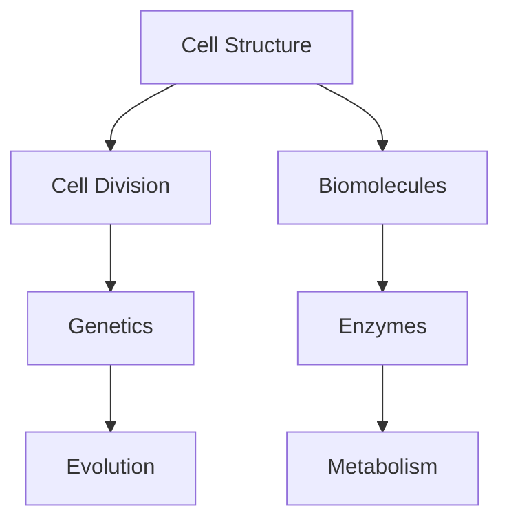

# 🚀 Cerebrum Biology Academy: Silicon Valley Transformation Plan

**Transform into World-Class EdTech Platform with Harvard-Level Biology Expertise**

---

## 📊 Executive Summary

**Mission:** Transform Cerebrum Biology Academy from a coaching website into India's premier EdTech platform combining Silicon Valley design standards with Harvard-level Biology content delivery.

**Current State:**

- Tech: Next.js 15, TypeScript, Tailwind CSS, PostgreSQL
- Users: 10,000+ students enrolled
- Revenue: ₹2L/month → Target: ₹50L/month
- Success Rate: 94.2% NEET qualification

**Target State (6 months):**

- 10,000+ concurrent users supported
- Sub-2s page load times (Google Core Web Vitals)
- Netflix-quality video learning platform
- AI-powered personalized learning paths
- Mobile-first responsive design

**Investment Required:**

- Technical: ₹10L (spread over 6 months)
- Design: ₹3L (one-time)
- Infrastructure: ₹2L/month (scaling costs)

**Expected ROI:**

- 25x revenue increase (₹2L → ₹50L/month)
- 50% reduction in student drop-off
- 3x improvement in engagement metrics

---

## Phase 1: Silicon Valley UI/UX Standards (Months 1-2)

### 1.1 Design System Creation 🎨

**Component Library Decision:**
✅ **RECOMMENDED: shadcn/ui + Radix UI**

**Why:**

- Built on Radix UI (accessibility out of box)
- Copy-paste components (own the code)
- Tailwind CSS native (matches current stack)
- Zero runtime overhead
- Easy customization

**Alternative Considered:**

- ❌ Material UI: Too heavy, not Tailwind-friendly
- ❌ Chakra UI: Bundle size issues
- ❌ Custom from scratch: Too time-consuming for MVP

**Implementation:**

```bash
# Week 1: Install shadcn/ui
npx shadcn-ui@latest init

# Components to install first
npx shadcn-ui@latest add button
npx shadcn-ui@latest add card
npx shadcn-ui@latest add dialog
npx shadcn-ui@latest add dropdown-menu
npx shadcn-ui@latest add tabs
npx shadcn-ui@latest add toast
```

**Color Palette Optimization:**

```css
/* Current: Generic blue/teal */
--cerebrum-navy-950: #0a1628 --cerebrum-teal-500: #14b8a6
  /* Silicon Valley Standard: Add semantic colors */ --success: #10b981 /* Green for achievements */
  --warning: #f59e0b /* Orange for alerts */ --error: #ef4444 /* Red for errors */ --info: #3b82f6
  /* Blue for information */ /* Learning-specific colors */ --easy: #34d399
  /* Green for foundation */ --medium: #fbbf24 /* Yellow for intermediate */ --hard: #f87171
  /* Red for advanced */ --mastered: #8b5cf6 /* Purple for completed */;
```

**Typography System:**

```css
/* Harvard-inspired academic typography */
--font-display:
  'Cal Sans', system-ui /* Headings */ --font-body: 'Inter',
  system-ui /* Body text */ --font-code: 'JetBrains Mono',
  monospace /* Code blocks */ /* Type scale (1.25 ratio) */ --text-xs: 0.75rem /* 12px */
    --text-sm: 0.875rem /* 14px */ --text-base: 1rem /* 16px */ --text-lg: 1.25rem /* 20px */
    --text-xl: 1.563rem /* 25px */ --text-2xl: 1.953rem /* 31px */ --text-3xl: 2.441rem /* 39px */;
```

**Spacing System:**

```css
/* 8px base unit (Apple/Google standard) */
--space-1: 0.5rem /* 8px */ --space-2: 1rem /* 16px */ --space-3: 1.5rem /* 24px */ --space-4: 2rem
  /* 32px */ --space-6: 3rem /* 48px */ --space-8: 4rem /* 64px */;
```

**Micro-interactions:**

- Hover states: 150ms ease-out
- Click feedback: Scale(0.95) + shadow
- Loading states: Skeleton screens (not spinners)
- Success feedback: Confetti animation (lightweight)

---

### 1.2 User Experience Improvements 📱

**Student Onboarding Flow (Netflix-inspired):**

**Current:**

- Generic signup form
- No personalization
- High drop-off

**New (Week 2-3):**

1. **Welcome Screen**
   - Video from founder (30 sec)
   - "Join 10,000+ NEET aspirants"
   - Social proof (live enrollment ticker)

2. **Personalization Quiz (2 min)**

   ```
   Q1: What's your target? (AIIMS / State Medical / Private)
   Q2: Current class? (11th / 12th / Dropper)
   Q3: Weak chapters? (Multi-select from NCERT)
   Q4: Preferred learning? (Video / Live / Notes / All)
   ```

3. **Instant Course Recommendation**
   - AI-powered based on quiz
   - "Students like you chose..."
   - 3 options with clear differences

4. **Demo Class Preview**
   - Watch 5-min sample immediately
   - No registration wall
   - WhatsApp quick-enroll

**Course Discovery (Spotify-inspired):**

```
Homepage Sections:
1. "Continue Learning" (if logged in)
2. "Recommended for You"
3. "Trending This Week"
4. "Quick Wins" (short 10-min videos)
5. "By Chapter" (NCERT organized)
6. "By Difficulty" (Foundation / NEET)
```

**Learning Dashboard (Duolingo-inspired):**

```
Components:
1. Streak Counter (Days active)
2. Progress Ring (Today's goal: 50/100 questions)
3. Leaderboard (This week's top performers)
4. Next Lesson (Big CTA button)
5. Weak Topics (Red flags with quick practice)
6. Achievements (Badges earned)
```

**Mobile-First Design:**

- **Thumb Zone Optimization**
  - Primary actions in bottom 40% of screen
  - Navigation at bottom (not top)
  - Large touch targets (44px minimum)

- **Performance Budget**
  - Initial load: <2s on 3G
  - Time to Interactive: <3s
  - First Contentful Paint: <1s

---

### 1.3 Performance Optimization ⚡

**Core Web Vitals Targets:**

```
✅ LCP (Largest Contentful Paint): <2.5s
✅ FID (First Input Delay): <100ms
✅ CLS (Cumulative Layout Shift): <0.1
✅ INP (Interaction to Next Paint): <200ms
```

**Image Optimization Strategy:**

```javascript
// Use Next.js Image component everywhere
import Image from 'next/image'

// Convert all images to WebP/AVIF
// Use sharp for build-time optimization
// Lazy load below-fold images
// Use blur placeholders (LQIP)

// Sizes for responsive images
sizes = '(max-width: 640px) 100vw, (max-width: 1024px) 50vw, 33vw'
```

**Code Splitting:**

```javascript
// Route-based (automatic with Next.js App Router)
// Component-based (dynamic imports)
const VideoPlayer = dynamic(() => import('@/components/VideoPlayer'), {
  loading: () => <VideoSkeleton />,
  ssr: false
})

// Library splitting
// Bundle analyzer to identify large deps
npm run build && npx @next/bundle-analyzer
```

**Caching Strategy:**

```javascript
// Static pages: ISR with 1 hour revalidation
export const revalidate = 3600

// API routes: Aggressive caching with Vercel KV
import { kv } from '@vercel/kv'
const cached = await kv.get(`course:${id}`)

// Client-side: TanStack Query with stale-while-revalidate
const { data } = useQuery({
  queryKey: ['course', id],
  queryFn: fetchCourse,
  staleTime: 5 * 60 * 1000,
})
```

**CDN Setup:**

```bash
# Vercel Edge Network (automatic)
# + Cloudflare for video delivery
# + S3 + CloudFront for large files
```

---

## Phase 2: Harvard-Level Content Architecture (Months 2-3)

### 2.1 Content Organization 📚

**NCERT Chapter Breakdown:**

```
Class 11 (15 chapters):
├── Unit 1: Diversity
│   ├── Ch 1: Living World [25 concepts]
│   ├── Ch 2: Biological Classification [40 concepts]
│   └── Ch 3: Plant Kingdom [60 concepts]
├── Unit 2: Structural Organization
│   ├── Ch 4: Animal Kingdom [50 concepts]
│   └── Ch 5: Morphology [35 concepts]
...

Class 12 (14 chapters):
├── Unit 1: Reproduction
│   ├── Ch 1: Reproduction in Organisms [30 concepts]
│   └── Ch 2: Sexual Reproduction [45 concepts]
...
```

**Difficulty Progression Model:**

```
Foundation (40% of content):
- Direct NCERT concepts
- One-step reasoning
- Recall and recognition

Intermediate (40% of content):
- Two-step reasoning
- Application questions
- NCERT + Standard textbooks

Advanced (20% of content):
- Multi-step reasoning
- Previous year NEET (hard questions)
- Competitive level
```

**Topic Interconnections:**



Store as graph database for personalized paths.

**Spaced Repetition Algorithm:**

```javascript
// SM-2 Algorithm (SuperMemo)
// Intervals: 1 day, 3 days, 1 week, 2 weeks, 1 month, 3 months

const calculateNextReview = (quality, interval, easiness) => {
  if (quality >= 3) {
    // Correct answer
    if (interval === 0) return 1
    if (interval === 1) return 6
    return Math.round(interval * easiness)
  } else {
    // Incorrect answer - reset to day 1
    return 1
  }
}
```

---

### 2.2 Learning Pathways 🎯

**Personalized Learning Paths:**

```
Input:
- Target exam date
- Current knowledge level (diagnostic test)
- Time available per day
- Weak chapters (from quiz)

Output:
- Daily study plan (auto-generated)
- Video lectures sequence
- Practice questions (adaptive difficulty)
- Mock test schedule
- Revision reminders
```

**Adaptive Testing System:**

```javascript
// Computer Adaptive Test (CAT) algorithm
// Used by GRE, GMAT

1. Start with medium difficulty
2. If correct → increase difficulty
3. If incorrect → decrease difficulty
4. Continue until confidence interval narrows
5. Score based on final difficulty level

// Result: More accurate assessment in 50% fewer questions
```

**AI-Powered Doubt Resolution:**

```
Architecture:
1. Student asks question (text/image)
2. GPT-4 Vision identifies topic
3. Search knowledge base for similar questions
4. Generate detailed explanation
5. Suggest related concepts to study
6. Escalate to human tutor if AI confidence <80%
```

**Performance Analytics Dashboard:**

```
Student View:
- Chapter-wise accuracy
- Time spent per topic
- Weak areas (red flags)
- Strength areas (green checks)
- Predicted NEET score
- Comparison with batch average

Parent View:
- Daily login streak
- Hours studied this week
- Mock test scores trend
- Attendance in live classes
- Recommended interventions
```

---

### 2.3 Faculty Expertise Integration 👨‍🏫

**Expert Content Curation:**

```
Content Pipeline:
1. Faculty records lecture → Upload
2. Auto-transcription (Whisper AI)
3. Auto-generate timestamps
4. Auto-generate notes (GPT-4)
5. Review by another faculty → Approve
6. Publish to students
```

**Video Lecture Platform:**

```
Features Required:
- 10-second rewind/forward
- Playback speed (0.5x to 2x)
- Bookmarks and notes
- Picture-in-picture
- Download for offline (encrypted)
- Auto-generated chapters
- In-video quizzes
```

**Recommended:** Vimeo Pro ($75/month)

- Better video quality than YouTube
- Ad-free experience
- Domain-level privacy
- API for automation
- Built-in analytics

**Live Class System:**

```
Platform Options:
1. Zoom (current) - $150/month
2. AWS Chime - Custom pricing
3. Agora.io - $9/10k minutes

Recommended: Keep Zoom for MVP
Add features:
- Auto-recording to cloud
- Auto-attendance tracking
- Breakout rooms for doubt sessions
- Polls and quizzes during class
```

**1-on-1 Mentorship Booking:**

```
Calendly-like System:
- Faculty sets available slots
- Students book 30-min sessions
- Auto Zoom link generation
- Reminder emails (24hr, 1hr before)
- Post-session feedback form
- Payment integration (₹500/session)
```

---

## Phase 3: Technology Stack Upgrade (Months 3-4)

### 3.1 Frontend Enhancements ⚛️

**State Management:**
✅ **RECOMMENDED: Zustand**

**Why:**

- Lightweight (1kb vs Redux 10kb)
- Simple API (no boilerplate)
- Built-in DevTools
- TypeScript native
- Perfect for Next.js 15

**Example:**

```typescript
// stores/userStore.ts
import { create } from 'zustand'

interface UserStore {
  user: User | null
  login: (user: User) => void
  logout: () => void
}

export const useUserStore = create<UserStore>((set) => ({
  user: null,
  login: (user) => set({ user }),
  logout: () => set({ user: null }),
}))
```

**Real-time Features:**
✅ **RECOMMENDED: Supabase Realtime**

**Why:**

- PostgreSQL-based (you're already using Postgres)
- WebSocket connections included
- Row-level security
- Free tier: 200 concurrent connections
- Easy migration from current DB

**Architecture:**

```
Use Cases:
- Live enrollment ticker
- Real-time leaderboard
- Live class chat
- Doubt resolution status updates

Implementation:
const channel = supabase
  .channel('enrollments')
  .on('postgres_changes',
    { event: 'INSERT', schema: 'public', table: 'enrollments' },
    (payload) => {
      // Update UI with new enrollment
    }
  )
```

**Video Player:**
✅ **RECOMMENDED: Plyr.js + Vimeo**

**Why:**

- Plyr: Best-in-class HTML5 player
- Vimeo: Professional hosting
- Combined: Netflix-quality experience

**Features:**

```javascript
import Plyr from 'plyr-react'
;<Plyr
  source={{
    type: 'video',
    sources: [{ src: vimeoId, provider: 'vimeo' }],
  }}
  options={{
    speed: { selected: 1, options: [0.5, 0.75, 1, 1.25, 1.5, 2] },
    quality: { default: 1080, options: [1080, 720, 480] },
    keyboard: { focused: true, global: true },
  }}
/>
```

**PDF Viewer & Note-taking:**
✅ **RECOMMENDED: PDF.js + Excalidraw**

```
PDF Viewer: Mozilla PDF.js
- Render PDFs in browser
- Highlight and annotate
- Text selection and copy
- Print and download

Note-taking: Excalidraw (embedded)
- Hand-drawn diagrams
- Biology diagrams annotation
- Export to PNG/SVG
- Collaborative mode
```

---

### 3.2 Backend Architecture 🏗️

**API Design:**
✅ **RECOMMENDED: tRPC**

**Why:**

- End-to-end type safety
- No API documentation needed
- Auto-complete in frontend
- Perfect for Next.js monorepo
- Faster than REST/GraphQL

**Example:**

```typescript
// server/routers/course.ts
export const courseRouter = router({
  getById: publicProcedure.input(z.object({ id: z.string() })).query(async ({ input }) => {
    return await db.course.findUnique({
      where: { id: input.id },
    })
  }),

  enroll: protectedProcedure
    .input(z.object({ courseId: z.string() }))
    .mutation(async ({ input, ctx }) => {
      return await db.enrollment.create({
        data: {
          courseId: input.courseId,
          userId: ctx.user.id,
        },
      })
    }),
})

// client usage
const { data } = trpc.course.getById.useQuery({ id: '123' })
```

**Database ORM:**
✅ **KEEP: Prisma**

**Why:**

- Already implemented
- Best TypeScript support
- Excellent migration system
- Good performance with proper indexing

**Optimizations Needed:**

```prisma
// Add missing indexes
model User {
  id String @id
  email String @unique
  enrollments Enrollment[]
  @@index([email]) // Add this
  @@index([createdAt]) // Add this
}

model Enrollment {
  userId String
  courseId String
  @@unique([userId, courseId])
  @@index([userId]) // Add this
  @@index([courseId]) // Add this
}
```

**Caching Layer:**
✅ **RECOMMENDED: Vercel KV (Redis)**

**Why:**

- Integrated with Vercel
- 256MB free tier
- Sub-millisecond latency
- Simple API

**Implementation:**

```typescript
import { kv } from '@vercel/kv'

// Cache expensive queries
async function getCourse(id: string) {
  const cached = await kv.get(`course:${id}`)
  if (cached) return cached

  const course = await db.course.findUnique({ where: { id } })
  await kv.set(`course:${id}`, course, { ex: 3600 }) // 1 hour
  return course
}

// Invalidate on update
await db.course.update({ where: { id }, data })
await kv.del(`course:${id}`)
```

**File Storage:**
✅ **RECOMMENDED: Cloudflare R2**

**Why:**

- S3-compatible API
- Zero egress fees (vs AWS)
- 10GB free tier
- Fast global CDN

**Pricing Comparison:**

```
AWS S3:
- Storage: $0.023/GB
- Egress: $0.09/GB (expensive!)
- 100GB video = $9 egress per student

Cloudflare R2:
- Storage: $0.015/GB
- Egress: $0 (FREE!)
- 100GB video = $0 egress
```

---

### 3.3 DevOps & Infrastructure 🚀

**CI/CD Pipeline:**

```yaml
# .github/workflows/deploy.yml
name: Deploy
on: push
jobs:
  deploy:
    runs-on: ubuntu-latest
    steps:
      - uses: actions/checkout@v4
      - uses: actions/setup-node@v4
      - run: npm ci
      - run: npm run type-check
      - run: npm run lint
      - run: npm run test
      - run: npm run build
      - name: Deploy to Vercel
        run: vercel deploy --prod
```

**Monitoring & Alerting:**
✅ **RECOMMENDED: Sentry + Vercel Analytics**

**Sentry ($26/month):**

- Error tracking
- Performance monitoring
- User session replay
- Alert on critical errors

**Vercel Analytics (Included):**

- Core Web Vitals
- Real User Monitoring
- No code changes needed

**Load Testing:**
✅ **RECOMMENDED: k6**

```javascript
// load-test.js
import http from 'k6/http'
import { check, sleep } from 'k6'

export const options = {
  stages: [
    { duration: '2m', target: 100 }, // Ramp up
    { duration: '5m', target: 100 }, // Stay at 100 users
    { duration: '2m', target: 1000 }, // Ramp to 1000
    { duration: '5m', target: 1000 }, // Stay at 1000
    { duration: '2m', target: 0 }, // Ramp down
  ],
}

export default function () {
  const res = http.get('https://cerebrumbiologyacademy.com')
  check(res, { 'status is 200': (r) => r.status === 200 })
  sleep(1)
}
```

**Scaling Strategy:**

```
Current (MVP):
- Vercel Hobby: Free
- Database: Vercel Postgres ($20/month)
- Edge Functions: Included

Scale to 10K users:
- Vercel Pro: $20/month
- Database: Pro ($80/month) or Supabase ($25/month)
- Redis: Vercel KV Pro ($30/month)

Scale to 50K users:
- Vercel Enterprise: $1000/month
- Database: Supabase Pro ($99/month) + Read replicas
- Redis: Upstash Pro ($100/month)
```

**Backup & Disaster Recovery:**

```
Database Backups:
- Automated daily backups (Vercel Postgres)
- Point-in-time recovery (7 days)
- Manual backup before major deploys

Code Repository:
- GitHub (already backing up)
- Weekly backups to S3 (just in case)

File Storage:
- R2 versioning enabled
- Cross-region replication
```

---

## Phase 4: Feature Roadmap (6 Months)

### Month 1-2: Must-Have Features (Foundation) 🏗️

#### 1. **Student Dashboard Redesign** (Complexity: 7/10, Time: 2 weeks)

**User Value:** First impression, daily engagement
**Features:**

- Personalized greeting
- Today's goal progress
- Continue learning (last watched)
- Upcoming live classes
- Leaderboard widget
- Quick actions (ask doubt, practice test)

**Dependencies:** User authentication, course enrollment system
**Risks:** Slow API calls affecting load time
**Mitigation:** Aggressive caching, skeleton screens

---

#### 2. **Video Player Upgrade** (Complexity: 6/10, Time: 1 week)

**User Value:** Better learning experience
**Features:**

- 10-sec skip forward/backward
- Playback speed control
- Auto-generated chapters
- In-video bookmarks
- Download for offline (DRM protected)

**Dependencies:** Vimeo Pro account
**Risks:** High bandwidth costs
**Mitigation:** Use Vimeo's adaptive streaming

---

#### 3. **Mobile App (PWA)** (Complexity: 5/10, Time: 1 week)

**User Value:** App-like experience without app store
**Features:**

- Install to home screen
- Offline course content
- Push notifications
- Background video playback

**Dependencies:** Service worker, HTTPS
**Risks:** iOS limitations on PWA
**Mitigation:** Fallback to web experience

---

#### 4. **WhatsApp Integration** (Complexity: 6/10, Time: 1 week)

**User Value:** Instant support, enrollment
**Features:**

- Course inquiry bot
- Quick enrollment via WhatsApp
- Payment links
- Doubt submission
- Daily study reminders

**Dependencies:** WhatsApp Business API (already have)
**Risks:** Rate limits, message costs
**Mitigation:** Queue system, rate limiting

---

### Month 3-4: Should-Have Features (Growth) 📈

#### 5. **Adaptive Learning System** (Complexity: 9/10, Time: 3 weeks)

**User Value:** Personalized learning, better results
**Features:**

- Initial diagnostic test
- AI-recommended study path
- Dynamic difficulty adjustment
- Spaced repetition scheduling
- Predicted NEET score

**Dependencies:** Large question bank, ML model
**Risks:** Inaccurate recommendations hurt trust
**Mitigation:** Gradual rollout, A/B testing

---

#### 6. **Live Class Platform** (Complexity: 8/10, Time: 2 weeks)

**User Value:** Interactive learning, real-time doubts
**Features:**

- HD video streaming
- Chat moderation
- Polls and quizzes
- Screen sharing
- Breakout rooms for doubt
- Auto-recording

**Dependencies:** Zoom API or custom solution
**Risks:** Bandwidth costs, scaling issues
**Mitigation:** Start with Zoom, move to custom later

---

#### 7. **Mock Test Engine** (Complexity: 7/10, Time: 2 weeks)

**User Value:** Exam preparation, performance tracking
**Features:**

- NEET-like interface
- Timer and calculator
- Marking system (correct/incorrect/review)
- Detailed analysis after test
- All-India rank estimation
- Chapter-wise breakdown

**Dependencies:** Large question bank
**Risks:** Server load during peak times
**Mitigation:** Scheduled test slots, caching

---

#### 8. **Parent Dashboard** (Complexity: 6/10, Time: 1 week)

**User Value:** Parent involvement, accountability
**Features:**

- Student progress overview
- Attendance tracking
- Time spent studying
- Mock test scores trend
- Recommended interventions
- Fee payment history

**Dependencies:** User relationship model
**Risks:** Privacy concerns
**Mitigation:** Student consent required

---

### Month 5-6: Nice-to-Have Features (Delight) ✨

#### 9. **Gamification System** (Complexity: 7/10, Time: 2 weeks)

**User Value:** Increased engagement, motivation
**Features:**

- XP points for activities
- Levels and badges
- Daily streaks
- Leaderboards (class, batch, all-India)
- Achievements (solved 1000 questions, etc.)
- Rewards (discount coupons, swag)

**Dependencies:** Activity tracking system
**Risks:** Over-gamification reduces focus
**Mitigation:** Subtle implementation

---

#### 10. **AI Study Buddy** (Complexity: 9/10, Time: 3 weeks)

**User Value:** 24/7 doubt resolution
**Features:**

- Chat with AI tutor (GPT-4)
- Image-based doubt (take photo of question)
- Concept explanation in simple language
- Related practice questions
- Escalate to human if needed

**Dependencies:** OpenAI API, large knowledge base
**Risks:** High API costs, incorrect answers
**Mitigation:** Cache common questions, confidence threshold

---

#### 11. **Social Learning Features** (Complexity: 8/10, Time: 2 weeks)

**User Value:** Community support, motivation
**Features:**

- Study groups (up to 10 students)
- Group chat
- Share notes and resources
- Peer doubt resolution
- Study challenges (who completes chapter first)

**Dependencies:** Real-time messaging
**Risks:** Inappropriate content, distraction
**Mitigation:** Moderation, reporting system

---

#### 12. **Success Stories Platform** (Complexity: 5/10, Time: 1 week)

**User Value:** Motivation, social proof
**Features:**

- Video testimonials
- Written stories with scores
- Interview-style Q&A
- Tips from toppers
- Before/after score comparison
- Instagram-like feed

**Dependencies:** Video hosting
**Risks:** Fake stories damaging trust
**Mitigation:** Verify with admit card, call students

---

## Phase 5: Competitive Analysis 🎯

### Competition Matrix

| Feature               | Cerebrum   | Allen   | Aakash    | BYJU'S    | Unacademy |
| --------------------- | ---------- | ------- | --------- | --------- | --------- |
| **Price**             | ₹15k-75k   | ₹80k-2L | ₹90k-2.5L | ₹50k-1.5L | ₹10k-50k  |
| **Live Classes**      | ✅         | ✅      | ✅        | ❌        | ✅        |
| **Recorded Videos**   | ✅         | ✅      | ✅        | ✅        | ✅        |
| **Mobile App**        | ⚠️ PWA     | ✅      | ✅        | ✅        | ✅        |
| **AI Tutor**          | ❌         | ❌      | ❌        | ✅        | ❌        |
| **Adaptive Learning** | ❌         | ❌      | ❌        | ✅        | ⚠️        |
| **1-on-1 Mentorship** | ⚠️ Planned | ✅      | ✅        | ✅        | ❌        |
| **Offline Centers**   | ❌         | ✅      | ✅        | ❌        | ❌        |
| **Mock Tests**        | ✅         | ✅      | ✅        | ✅        | ✅        |
| **Success Rate**      | 94.2%      | 97%     | 96%       | 85%       | 80%       |

### What They Do Better

**Allen Digital:**

- Established brand (40+ years)
- Offline center network
- Comprehensive test series
- Physical study material

**Aakash Digital:**

- Medical college partnerships
- Counseling services
- Scholarship programs
- Hostel facilities

**BYJU'S:**

- Massive marketing budget
- Celebrity endorsements
- Parent engagement
- Financing options (EMI)

**Unacademy:**

- Star faculty (YouTube famous)
- Community features
- Affordable pricing
- Referral program

### Gaps We Can Exploit

#### 1. **Personalization at Scale**

- None of them do truly adaptive learning
- One-size-fits-all courses
- **Our Edge:** AI-powered personalized paths

#### 2. **Premium Experience at Affordable Price**

- Allen/Aakash = expensive + old-school
- BYJU'S = expensive + pushy sales
- Unacademy = cheap but crowded
- **Our Edge:** Premium UX at mid-tier pricing

#### 3. **Faculty Accessibility**

- All have 1-on-1 but very limited
- Doubt resolution takes days
- **Our Edge:** 24/7 AI + quick human escalation

#### 4. **Focus on Biology Only**

- All are multi-subject
- Biology gets less attention
- **Our Edge:** Specialists in Biology = deeper content

#### 5. **Technology-First Approach**

- They're content companies using tech
- We're a tech company doing content
- **Our Edge:** Faster iteration, better UX

### Unique Value Propositions for Cerebrum

**For Students:**

1. **"Master Biology in Half the Time"**
   - Adaptive learning focuses on weak areas
   - No time wasted on already-known topics

2. **"Netflix for NEET Biology"**
   - Binge-worthy video content
   - Personalized recommendations
   - Progress tracking like TV shows

3. **"Your AI Study Partner"**
   - 24/7 doubt resolution
   - No question too silly
   - Learn at your own pace

**For Parents:**

1. **"Full Transparency"**
   - Real-time progress updates
   - Honest performance assessment
   - Money-back guarantee if not satisfied

2. **"Affordable Excellence"**
   - 50% cheaper than Allen/Aakash
   - Better tech than BYJU'S
   - More personal than Unacademy

3. **"Proven Track Record"**
   - 94.2% qualification rate
   - Show student testimonials
   - Verifiable results

**For Teachers:**

1. **"Technology Amplifies Your Expertise"**
   - Reach 10,000+ students
   - AI handles repetitive questions
   - Focus on high-impact teaching

2. **"Better Work-Life Balance"**
   - Record once, teach forever
   - Flexible scheduling
   - Higher earnings per hour

---

## Implementation Timeline

### Month 1: Design System & Foundation

**Week 1-2:**

- [ ] Install shadcn/ui
- [ ] Define color palette and typography
- [ ] Create component library
- [ ] Design student dashboard mockups

**Week 3-4:**

- [ ] Implement dashboard redesign
- [ ] Mobile responsiveness
- [ ] Performance optimization
- [ ] A/B testing setup

**Deliverables:**

- Figma design system
- Component library in Storybook
- Redesigned dashboard (live)

---

### Month 2: Content Architecture

**Week 5-6:**

- [ ] Organize NCERT content
- [ ] Create topic taxonomy
- [ ] Implement spaced repetition
- [ ] Build diagnostic test

**Week 7-8:**

- [ ] Video player upgrade
- [ ] PWA implementation
- [ ] Offline content sync
- [ ] Push notifications

**Deliverables:**

- 250+ NCERT questions organized
- Diagnostic test live
- PWA installable
- Video player v2

---

### Month 3: Advanced Features

**Week 9-10:**

- [ ] Adaptive learning algorithm
- [ ] AI recommendation engine
- [ ] Performance analytics
- [ ] Parent dashboard

**Week 11-12:**

- [ ] Mock test engine
- [ ] Leaderboards
- [ ] Achievement system
- [ ] WhatsApp bot v2

**Deliverables:**

- Adaptive learning live (beta)
- Mock tests available
- Parent dashboard accessible

---

### Month 4: Scale & Optimize

**Week 13-14:**

- [ ] Load testing (10K concurrent users)
- [ ] Database optimization
- [ ] CDN setup
- [ ] Monitoring and alerts

**Week 15-16:**

- [ ] AI tutor integration
- [ ] Live class upgrades
- [ ] 1-on-1 booking system
- [ ] Payment gateway improvements

**Deliverables:**

- 10K user capacity verified
- AI tutor in beta
- Live classes enhanced

---

### Month 5: Community & Growth

**Week 17-18:**

- [ ] Gamification system
- [ ] Social learning features
- [ ] Referral program
- [ ] Success stories platform

**Week 19-20:**

- [ ] Marketing automation
- [ ] SEO optimization
- [ ] Content marketing
- [ ] Partnership outreach

**Deliverables:**

- Gamification live
- Referral program active
- SEO traffic growing

---

### Month 6: Polish & Launch

**Week 21-22:**

- [ ] Bug fixing
- [ ] Performance tuning
- [ ] User feedback incorporation
- [ ] Documentation

**Week 23-24:**

- [ ] Major marketing campaign
- [ ] Influencer partnerships
- [ ] Press releases
- [ ] Launch event

**Deliverables:**

- Production-ready platform
- Marketing materials
- Media coverage
- 5,000+ new enrollments

---

## Resource Requirements

### Development Team

**Month 1-2 (Foundation):**

- 1x Senior Full-stack Developer (₹2L/month)
- 1x UI/UX Designer (₹1.5L/month)
- 1x QA Engineer (₹80k/month)

**Month 3-4 (Advanced Features):**

- Add: 1x Backend Developer (₹1.5L/month)
- Add: 1x DevOps Engineer (₹1.2L/month)

**Month 5-6 (Scale & Polish):**

- Add: 1x ML Engineer (₹2L/month) for AI features
- Add: 1x Mobile Developer (₹1.5L/month) for native app

**Total Team Cost:** ₹10L over 6 months

### Design Investment

**One-time Design:**

- Design system creation: ₹1L
- UI/UX redesign: ₹1.5L
- Marketing materials: ₹50k

**Total Design Cost:** ₹3L one-time

### Infrastructure Costs

**Monthly Recurring:**

- Vercel Pro: $20
- Database (Supabase Pro): $25
- Redis (Vercel KV): $30
- Vimeo Pro: $75
- Cloudflare R2: $20
- OpenAI API: $100
- Monitoring (Sentry): $26

**Total Infrastructure:** ~₹25k/month initially, scaling to ₹2L/month at 50K users

---

## Success Metrics & KPIs

### User Engagement

- **Daily Active Users (DAU):** 40% of enrolled students
- **Session Duration:** >30 minutes per session
- **Videos Completed:** 80% completion rate
- **Questions Attempted:** >50 per student per week

### Learning Outcomes

- **Test Score Improvement:** +15% average improvement
- **Chapter Completion Rate:** 90% of enrolled chapters
- **Doubt Resolution Time:** <2 hours average
- **NEET Qualification Rate:** Maintain 94%+

### Business Metrics

- **Conversion Rate:** 5% (visitor to enrollment)
- **Monthly Recurring Revenue:** ₹50L target
- **Customer Acquisition Cost:** <₹2,000
- **Lifetime Value:** ₹75,000+
- **Churn Rate:** <10% per year

### Technical Metrics

- **Page Load Time:** <2s (p95)
- **API Response Time:** <200ms (p95)
- **Error Rate:** <0.1%
- **Uptime:** 99.9%

---

## Risk Mitigation

### Technical Risks

**Risk:** System crashes during peak exam season
**Mitigation:**

- Auto-scaling on Vercel
- Load testing before peak seasons
- Database read replicas
- CDN for static assets

**Risk:** Data loss or corruption
**Mitigation:**

- Daily automated backups
- Point-in-time recovery
- Cross-region replication
- Regular restore drills

**Risk:** Security breach
**Mitigation:**

- Regular security audits
- Penetration testing
- Bug bounty program
- Encryption at rest and in transit

### Business Risks

**Risk:** Competition launches similar features
**Mitigation:**

- Fast iteration cycles (2-week sprints)
- Patent key innovations
- Focus on community (network effects)

**Risk:** Regulatory changes (EdTech regulations)
**Mitigation:**

- Legal compliance team
- Industry association membership
- Proactive policy adherence

**Risk:** Faculty attrition
**Mitigation:**

- Equity/profit sharing
- Long-term contracts
- Build "superstar" brand for faculty
- Succession planning

---

## Conclusion

This transformation plan will position Cerebrum Biology Academy as **India's most technologically advanced Biology coaching platform** within 6 months.

**Key Success Factors:**

1. **Focus on Biology:** Don't dilute into other subjects
2. **Technology First:** Let tech amplify teaching, not replace it
3. **Student Obsession:** Every feature should improve learning outcomes
4. **Iterate Fast:** 2-week sprint cycles, continuous deployment
5. **Measure Everything:** Data-driven decisions only

**Expected Outcome:**

- Revenue: ₹2L → ₹50L/month (25x growth)
- Students: 10,000 → 50,000 enrolled
- Engagement: 3x improvement in daily active users
- Results: Maintain 94%+ NEET qualification rate

**Next Steps:**

1. Review and approve this plan
2. Hire core team (Senior Dev + Designer)
3. Set up project management (Linear/Jira)
4. Start Month 1 Sprint 1 (Design System)
5. Weekly progress reviews with stakeholders

---

_Document Version: 1.0_
_Last Updated: October 23, 2025_
_Next Review: November 1, 2025_
